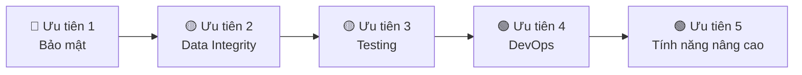

# 🏢 Rin_UniOps Club Management — Kiểm định Toàn diện Hệ thống

> Đánh giá mức độ hoàn thiện, chuyên nghiệp, và sẵn sàng thực tế so với các nền tảng quản lý hàng đầu (Asana, Monday.com, Slack, BambooHR, Clubhouse).

---

## 📊 Tổng quan Đánh giá

| Tiêu chí | Điểm | Mô tả |
|----------|------|-------|
| **Kiến trúc Backend** | ⭐⭐⭐⭐ 8/10 | Cấu trúc rõ ràng, phân tầng chuẩn MVC, DTO pattern |
| **Luồng nghiệp vụ** | ⭐⭐⭐⭐ 7.5/10 | State machines, validation, authorization đã có — thiếu một số edge case |
| **Bảo mật** | ⭐⭐⭐ 6.5/10 | JWT + RBAC cơ bản đã có — thiếu nhiều lớp bảo mật production |
| **Giao diện (UX/UI)** | ⭐⭐⭐⭐ 8/10 | Glassmorphism, animations, responsive — rất đẹp |
| **Tính năng đầy đủ** | ⭐⭐⭐⭐ 8/10 | 12+ module chức năng phủ rộng — thiếu vài tính năng nâng cao |
| **Sẵn sàng Production** | ⭐⭐⭐ 6/10 | Cần bổ sung nhiều thành phần trước khi triển khai thực tế |
| **Tổng thể** | **7.3/10** | **Rất tốt cho đồ án/MVP — cần nâng cấp để production** |

---

## ✅ ĐIỂM MẠNH — Những gì đã làm TỐT

### 1. Kiến trúc Backend chuyên nghiệp
```
Controller → Service → Repository → Entity
     ↓           ↓
   DTO/Request  DTO/Response
     ↓
GlobalExceptionHandler
```
- ✅ **20 Entity** với quan hệ JPA đầy đủ (OneToMany, ManyToOne, ManyToMany)
- ✅ **20 Controller** với RESTful API chuẩn
- ✅ **20 Service** xử lý business logic
- ✅ **15 Request DTO + 13 Response DTO** tách biệt input/output
- ✅ **GlobalExceptionHandler** bắt tất cả exception và trả JSON chuẩn

### 2. Luồng nghiệp vụ có State Machine
- ✅ Event: `DRAFT → PLANNING → APPROVED → ONGOING → COMPLETED` (+ CANCELLED)
- ✅ Task: `TODO → IN_PROGRESS → REVIEW → DONE` (+ REJECTED → reopen)
- ✅ Evaluation: `DRAFT → SUBMITTED → REVIEWED`
- ✅ Attendance: `PRESENT / ABSENT / LATE / EXCUSED`
- ✅ Validate transition hợp lệ, chặn lùi trạng thái

### 3. Hệ thống phân quyền RBAC
- ✅ 3 role: `ADMIN > MANAGER > MEMBER`
- ✅ `@PreAuthorize` trên Controller
- ✅ Business-level authorization (Manager chỉ quản lý ban mình)
- ✅ Route guard trên Frontend (AdminRoute, ManagerRoute, ProtectedLayout)

### 4. Hệ thống Gamification
- ✅ XP system: Check-in (+10), Task done (+20), Comment (+2)
- ✅ Level up tự động (100 XP/level)
- ✅ Leaderboard top 10
- ✅ Notification khi level up

### 5. Tích hợp thanh toán VNPay
- ✅ Tạo URL thanh toán với HMAC-SHA512
- ✅ Callback validation chống giả mạo
- ✅ Hỗ trợ sandbox testing

### 6. Real-time features
- ✅ WebSocket STOMP cho Chat và Notification
- ✅ Push notification real-time đến từng user
- ✅ Chat rooms (Team/Department/Direct)

### 7. Các tính năng nâng cao
- ✅ QR Code attendance (tạo + quét)
- ✅ CSV Export (Attendance, Evaluations)
- ✅ File Upload (10MB limit)
- ✅ AI Assistant (tích hợp OpenAI GPT-4o-mini)
- ✅ Leave Request system (xin phép nghỉ)
- ✅ SubTask + Comment trong Task
- ✅ Schedule đồng bộ Event Sessions + Task Deadlines
- ✅ Org Chart visualization
- ✅ HR Team Management

---

## 🔴 THIẾU SÓT NGHIÊM TRỌNG — Cần có để Production

### 1. Bảo mật (Security)

| Vấn đề | Mức độ | Chi tiết |
|--------|--------|----------|
| **JWT Secret hardcoded** | 🔴 Critical | Secret key nằm trong `application.properties`, ai có source code đều đọc được |
| **Không có Refresh Token** | 🔴 Critical | JWT hết hạn = user phải login lại, không có cơ chế refresh im lặng |
| **CORS `*` wildcard** | 🟡 Medium | `setAllowedOriginPatterns(Arrays.asList("*"))` cho phép mọi domain gọi API |
| **Không có Rate Limiting** | 🟡 Medium | Không chống brute-force login, spam API |
| **Password không validate** | 🟡 Medium | Register chấp nhận mật khẩu "1" — không yêu cầu độ dài/ký tự đặc biệt |
| **Không có Account Lockout** | 🟡 Medium | Đăng nhập sai không giới hạn số lần |
| **Không có HTTPS enforcement** | 🟡 Medium | Chưa cấu hình redirect HTTP → HTTPS |
| **SQL Injection qua JPA** | 🟢 Safe | JPA parameterized queries — an toàn |

### 2. Xử lý lỗi & Validation

| Vấn đề | Mức độ | Chi tiết |
|--------|--------|----------|
| **Thiếu `@Valid` trên Request DTO** | 🔴 Critical | Nhiều endpoint nhận `Map<String, Object>` thay vì DTO có `@NotBlank`, `@Size` |
| **Schedule Controller dùng raw Map** | 🟡 Medium | `@RequestBody Map<String, Object>` không validate input |
| **Không có pagination** | 🟡 Medium | `findAll()` trả về toàn bộ records — sẽ chậm khi data lớn |
| **Event Service `getAllEvents` hiệu suất** | 🟡 Medium | Load toàn bộ events rồi filter theo department — nên dùng query DB |

### 3. Data Integrity

| Vấn đề | Mức độ | Chi tiết |
|--------|--------|----------|
| **Không có Unique Constraint trên Schedule** | 🟡 Medium | Có thể tạo trùng schedule cho cùng scope+week |
| **Cascade Delete thiếu kiểm soát** | 🟡 Medium | Xóa Event → cascade xóa tất cả Sessions + Tasks — production nên soft delete |
| **Không có Soft Delete** | 🟡 Medium | Xóa là mất vĩnh viễn, không khôi phục được |
| **Không có Audit Trail** | 🔴 Critical | Không ghi log ai thay đổi gì, lúc nào — production bắt buộc phải có |

### 4. Testing

| Vấn đề | Mức độ | Chi tiết |
|--------|--------|----------|
| **0 Unit Test** | 🔴 Critical | Chỉ có 1 file `ClubManagementApplicationTests.java` (Spring Boot mặc định) |
| **0 Integration Test** | 🔴 Critical | Không có test cho bất kỳ API endpoint nào |
| **0 Frontend Test** | 🟡 Medium | Không có Jest/Vitest test cho React components |

---

## 🟡 THIẾU SÓT VỪA — Cần có để chuyên nghiệp

### 5. Tính năng quản lý nâng cao

| Tính năng | Có chưa? | So sánh với industry |
|-----------|----------|---------------------|
| **Phân trang (Pagination)** | ❌ | Mọi platform đều có — bắt buộc khi data > 100 records |
| **Tìm kiếm & Lọc nâng cao** | ❌ | Asana/Monday có filter theo status, date range, assignee, priority |
| **Lịch sử hoạt động (Activity Log)** | ❌ | BambooHR/Jira ghi log mọi thay đổi trên từng entity |
| **Xuất báo cáo PDF** | ❌ | Chỉ có CSV — production cần PDF với template chuyên nghiệp |
| **Email Notification** | ❌ | Chỉ có in-app notification — cần email cho các sự kiện quan trọng |
| **Đa ngôn ngữ (i18n)** | ❌ | Hệ thống hardcode tiếng Việt + tiếng Anh lẫn lộn |
| **Dark/Light Theme toggle** | ⚠️ Partial | Có member-mode CSS nhưng không có toggle thủ công |
| **Forgot Password / Reset** | ❌ | Không có flow quên mật khẩu |
| **2FA (Two-Factor Auth)** | ❌ | Không có xác thực 2 bước |
| **File versioning** | ❌ | Upload file nhưng không lưu version |
| **Calendar view (ngày/tháng)** | ⚠️ Partial | Chỉ có week view — cần month view, day view |
| **Drag & Drop task** | ❌ | Kanban board không hỗ trợ kéo thả giữa cột |
| **Task dependency** | ❌ | Không có task phụ thuộc (blocked by) |
| **Recurring events** | ❌ | Sự kiện lặp lại hàng tuần/tháng |
| **Event budget tracking** | ❌ | Không theo dõi ngân sách sự kiện |

### 6. DevOps & Deployment

| Vấn đề | Có chưa? | Chi tiết |
|--------|----------|----------|
| **Dockerfile** | ❌ | Không có containerization |
| **docker-compose.yml** | ❌ | Không có orchestration cho MySQL + Backend + Frontend |
| **CI/CD pipeline** | ❌ | Không có GitHub Actions / GitLab CI |
| **Environment profiles** | ❌ | Chỉ có 1 `application.properties` — cần dev/staging/prod |
| **Health check endpoint** | ❌ | Không có `/actuator/health` |
| **Logging framework** | ⚠️ Basic | Chỉ có Hibernate SQL logging — thiếu structured logging (SLF4J + Logback) |
| **API documentation** | ❌ | Không có Swagger/OpenAPI spec |

---

## 📋 So sánh với các Platform hàng đầu

### Asana (Task Management)
| Feature | Asana | Rin_UniOps |
|---------|-------|-----------|
| Task CRUD | ✅ | ✅ |
| SubTask | ✅ | ✅ |
| Comments | ✅ | ✅ |
| Task status workflow | ✅ | ✅ |
| Drag & Drop Kanban | ✅ | ❌ |
| Task dependencies | ✅ | ❌ |
| Custom fields | ✅ | ❌ |
| Timeline/Gantt | ✅ | ❌ |
| Recurring tasks | ✅ | ❌ |
| Search & Filter | ✅ | ❌ |

### Slack (Communication)
| Feature | Slack | Rin_UniOps |
|---------|-------|-----------|
| Direct messages | ✅ | ✅ |
| Group channels | ✅ | ✅ (Team/Department rooms) |
| WebSocket real-time | ✅ | ✅ |
| File sharing | ✅ | ⚠️ (Upload có, chưa tích hợp vào chat) |
| Message reactions | ✅ | ❌ |
| Thread replies | ✅ | ❌ |
| Search messages | ✅ | ❌ |
| Online presence | ✅ | ❌ |

### BambooHR (HR Management)
| Feature | BambooHR | Rin_UniOps |
|---------|----------|-----------|
| Employee profiles | ✅ | ✅ |
| Department/Team structure | ✅ | ✅ |
| Org Chart | ✅ | ✅ |
| Leave management | ✅ | ✅ |
| Performance reviews | ✅ | ✅ (Self + Manager eval) |
| Attendance tracking | ✅ | ✅ (QR + manual) |
| CSV Export | ✅ | ✅ |
| Payroll | ✅ | ❌ (chỉ có payment tracking) |
| Document management | ✅ | ❌ |
| Onboarding workflow | ✅ | ❌ |

---

## 🎯 Kết luận & Khuyến nghị

### Điểm mạnh nổi bật
Dự án đã đạt mức **MVP++ (Minimum Viable Product rất hoàn chỉnh)** với:
- 12+ module chức năng phủ rộng mọi mặt quản lý CLB
- Business logic có chiều sâu (state machine, RBAC, gamification)
- UI/UX hiện đại và chuyên nghiệp
- Real-time features (WebSocket, Notification)
- Tích hợp bên thứ ba (VNPay, OpenAI)

### Để đưa vào thực tế (Production), cần ưu tiên:



| Ưu tiên | Hành động | Ước tính |
|---------|-----------|----------|
| 🔴 **1** | Refresh Token, Rate Limiting, Password Policy, env variables cho secrets | 2-3 ngày |
| 🔴 **2** | Audit Trail, Soft Delete, Pagination, Input Validation (@Valid) | 3-4 ngày |
| 🟡 **3** | Unit Tests cho Service layer (ít nhất 50% coverage) | 3-5 ngày |
| 🟡 **4** | Dockerfile, docker-compose, Swagger API docs | 2 ngày |
| 🟢 **5** | Email notifications, Drag-drop Kanban, Search/Filter | 5-7 ngày |

### Tóm tắt cuối cùng

> [!IMPORTANT]
> **Với mục đích đồ án / demo:** Dự án đã **ĐỦ TỐT** và **rất ấn tượng** — vượt trội so với phần lớn các đồ án cùng phạm vi.
>
> **Với mục đích triển khai thực tế:** Cần bổ sung **bảo mật**, **testing**, **pagination**, và **audit trail** trước khi đưa người dùng thật vào sử dụng. Đây là khoảng cách tự nhiên giữa MVP và Production mà mọi startup đều trải qua.
